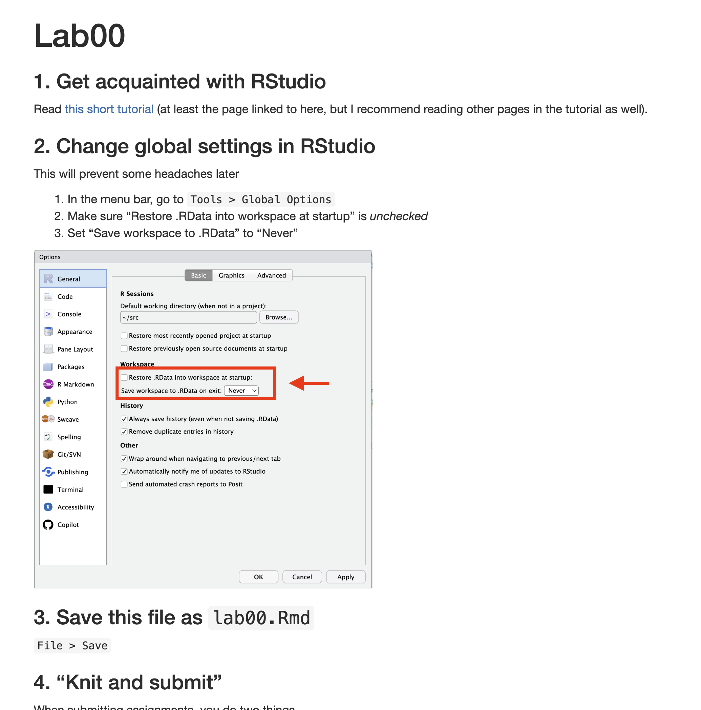

### 1. Get acquainted with RStudio

Read [this short tutorial](https://www.gastonsanchez.com/R-ice-breaker/1-07-rstudio-tour.html) (at least the page linked to here, but I recommend reading other pages in the tutorial as well).

### 2. Change global settings in RStudio

This will prevent some headaches later

1.  In the menu bar, go to `Tools > Global Options`
2.  Make sure "Restore .RData into workspace at startup" is *unchecked*
3.  Set "Save workspace to .RData" to "Never"

{width="485"}

### 3. Save this file

`File > Save` or click the little save icon in the toolbar

### 4. Write and run some code

Literally just **run the cell below** by clicking the little "play" icon in the top right:

```{r}
print("This is lab 00")
```

Create a new code cell below. Click to put your cursor where it says "YOUR CODE CELL HERE" below. Then do one of the following to make a new cell:

-   In the main RStudio menu bar, click Code \> Insert Chunk

-   Click the "+C" (green button) on the toolbar, it looks like this:

    {width="421"}

Once you have a new cell, write code to have it print "My name is [your name here]" and run the cell. (Use the previous cell for reference)

**--\> YOUR CODE CELL HERE \<---**

### 5. "Knit and submit"

When submitting assignments, you do a few things

1.  You "knit" the file to a more presentable format (`pdf` in our case)
2.  Download the pdf file
3.  Submit on gradescope

**Knitting** **to pdf**

First, at the top of this file, look at the "front matter" that looks like this:


Edit where it says "YOUR NAME HERE" to... your actual name. There are many other things you can do in this "front matter" but we'll start simple.

**Then just click the "Knit" button in the toolbar**, which will open a window with the rendered file:

{width="341"}

You'll see a more "presentable" version of the document, like this:

{width="364"}

**Notice, in RStudio, you'll now have a `Lab00.pdf`** file:

In the bottom-right `Files` pane:

{width="289"}

**Download the pdf file**

Check the empty checkbox next to the file:

{width="338"}

Click the Gear ("More") icon in the `Files` pane toolbar and select `Export`

{width="278"}

**Save somewhere you can find it**

**Submit on Gradescope**

-   FIRST TIME ONLY - go to bCourses for thic class, then click "Gradescope" on the left sidebar. This will get you set up and logged in. From then on, you can just click the link on the course home page (below).

-   Log into Gradescope (course homepage \> click "Gradescope")

-   Click on "assignments"

-   Click Lab 00

-   Fill out the form and upload your pdf

## **You're done with Lab 00!**

## **Don't forget the other assignment due tonight, the pre-course survey (see website)**
