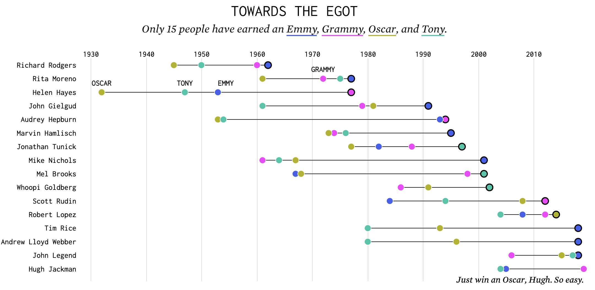

# Key Resources for this lab

1.  [**ggplot documentation**](https://ggplot2.tidyverse.org/) - for making plots, and tweaking them
2.  [**dplyr documentation**](https://dplyr.tidyverse.org/) - for altering datasets, e.g. filterout out rows, adding new columns, grouping and aggregating, etc.
3.  [**PingPong LLM**](https://pingpong.hks.harvard.edu/group/62/assistant) (also linked to on the course homepage) - for help when you get stuck - though you can always ask Everett or Huong.
4.  **Knit early and often** - you'll find errors in your code this way, as "Knit" resets the whole R-brain before running your code. If the Knit fails, look in the console for errors (bottom left panel of RStudio) or go to the top menu bar and select `Session > Restart R and run all chunks` - then the errors will show up a the appropriate places in your file.

## Load libraries in their own cell at the top. Always.

**DIRECTIONS: Run the cell below. `tidyverse` is a super-library that includes `ggplot`, `dplyr`, and everything else we might need. You'll rarely need more than this for coding in this class.**

```{r}
library(tidyverse)
```

## Part 1 - NYC Stop-and-Frisk

**Q1-1: There is a dataset in `data/nyc_stops.csv` - read it in with `read_csv` and save it as a variable named `stops`**

**NOTE: Each row in the dataframe is one instance of a police officer stopping someone on the street in New York City. Sometimes, the officer suspects that something is up, and pats the person down looking for weapons or drugs (this is called a "frisk"). Other times, officers stop someone to talk, but don't frisk them.**

YOUR CODE HERE

**Q1-2: Inspect the dataframe:**

1.  **How many rows and columns are in the dataframe? How did you figure that out? (There are several ways to answer this question)**
2.  **What are the column names? (Try the `colnames` function)**

YOUR ANSWER HERE (with code, if you used any)

**Q1-3: Make a (vertical) bar plot showing how many stops there were for each race**

YOUR CODE CELL HERE

**Q1-4: Now make the same plot, but with horizontal bars**

YOUR CODE CELL HERE

**Q1-5: Make the same horizontal-bar plot, but prettier: (Hint: use PingPong for help!)**

1.  **Make each bar a different solid color (note, `color` and `fill` are different aesthetic elements!)**
2.  **Change the x-axis label to something more informative, like "Number of stops"**
3.  **Change the y-axis label to something more informative (or remove it if you think that's better)**
4.  **Add a title to the plot**
5.  **Change the font size of the bar labels - make them larger**
6.  **BONUS #1: Remove the legend that shows what race is what color. You don't need this information, as it's already obvious from the bar labels.**
7.  **BONUS #2: Change the tick marks on the x-axis to be more readable. That is, instead of "1200000" have it read "1,200,000" or perhaps "1.2 Million." Same for the other ticks.**

YOUR CODE CELL HERE

**Q1-6: Make a pie chart with the same information**

1.  **Use PingPong LLM for help**
2.  **BONUS CHALLENGE: Make a *donut* chart.**

YOUR CODE CELL HERE

## Part 2: Orange trees

**DIRECTIONS: R offers some built-in datasets to play with. For starters, run the cell below to see all the datasets available to you.**

```{r}
data()
```

**DIRECTIONS: For this part, we'll work with the `Orange` dataset, which shows growth data over time for some orange trees. Run the cell below to bring this dataset into our environment so we can play with it. Then click on "Orange" in the environment pane (top right of RStudio) to look at the data.**

```{r}
data(Orange)
```

**Q2-1: What do the rows and columns in this dataset mean? Hint: for built-in datasets like this, you can often get useful information by running `?[dataset name]`. Run the cell below, and look in the bottom-right panel in RStudio for the help information.**

YOUR ANSWER HERE

**Q2-2: Make a line plot showing the growth of each of the five trees over time.**

1.  **First make the line plot** (`geom_line` will be useful, but you'll have to map *some* aesthetic element to Tree so it knows what points to connect in a line)
2.  **Then change the x and y labels to be more clear** (e.g. "age in years" [or whatever age means - look it up])
3.  **Add a plot title**
4.  **Notice that the y axis doesn't start at zero. Fix that.**
5.  **BONUS: The trees are listed in the legend out-of-order. Change the legend so that 1 appears on top, then 2, then 3, etc.** Hint: you'll have to turn the `Tree` column into a factor.

YOUR CODE CELL HERE

## Part 3 - Baby Chicks

**Q3-1: For this part, we'll be using the `ChickWeight` dataset.**

1.  **Bring it into the environment, like we did with the orange tree data.**
2.  **How many rows and columns are there?**
3.  **What does a single row mean?**
4.  **What does each column mean? (Hint: try getting help on the dataset, like we did for Oranges above)**

```{r}
data(ChickWeight)
?ChickWeight
```

**Q3-2: Make a *scatterplot* of time vs weight. Steps:**

1.  **Make the basic plot**
2.  **Change the axes labels to something more informative**
3.  **Add a plot title**
4.  **Make each point colored according to the chick's `Diet`**
5.  **Make the points partially transparent, since they will overlap a lot. (Hint: add an `alpha` parameter to `geom_point`)**

YOUR CODE CELL HERE

**DIRECTIONS: Hmm this is not a very informative plot. Let's *average* across all chicks who have the same diet.**

**Q3-3: Starting with your code from the previous question, add lines of code so that we have only one datapoint for all chicks with a given diet at a given time.**

1.  **Make the core plot**
2.  **Add lines *in addition to* the points**
3.  **BONUS CHALLENGE: change the size of the points to reflect the *number of chicks* in that group. Don't change the size of the lines! (This is a bit tricky). Do you think this improves the plot? Why or why not?**

YOUR CODE CELL HERE

**Q3-4: Visually plot the growth of ALL individual chicks over time, using this unusual format:**

1.  **The x-axis should still be Time**
2.  **The y-axis should be the chick's number - so there will be a line of dots across the plot for each individual chick.**
3.  **There should be one point for each chick at each time point, and the *size* of the point should be proportionate to the chick's weight.**
4.  **The points should be colored by diet.**
5.  **Don't forget axis labels and a plot title**
6.  **Do you think this plot is useful? What do you like/dislike about it? What might you change?**
7.  **Make the plot taller so that all the points fit.** Hint: you'll have to change what's in the `{r}` a the top of the cell to set the figure height and width. (Remember: PingPong will help you!)
8.  **BONUS CHALLENGE: Right now, the "time" markers are at the bottom of the plot, which is a little weird when you try to read from the top down. Change the plot so the x axis label and tick marks show up at the top of the plot.**

YOUR CODE CELL HERE

### **Q3-5: Plot the distribution of chick weights at time 10.**

1.  **Use a histogram (geom_histogram)**
2.  **Don't forget to label you axes and give the plot a title**
3.  **Change the width of the histogram bins to something a little wider, until the plot looks nicer (hint: there is a `binwidth` argument to `geom_histogram`)**
4.  **Now also map the `fill` color to `Diet` . How would you interpret this plot? What is good and bad about it?**

YOUR CODE CELL HERE

## **Part 6 - Emmy, Grammy, Oscar, Tony (EGOT)**

**CONTEXT: Of the many awards for performing artists, four are especially sought after - the Emmy (for a tv series), the Grammy (for a music song or album), the Oscar (for a movie performance), and the Tony (for a live theater production). Very few people have won all four of these. There is a dataset on these people in your folder, `data_egot.csv.`** We are going to work towards building this plot (in pieces):

{width="670"}

**Q6-1: Load and examine**

1.  **Load the dataset into a variable called `egot`**
2.  **How many rows and columns does it have?**
3.  **What does each row mean? What do the columns mean?**

YOUR CODE CELL HERE

**Q6-2: Make the core of the plot:**

1.  **Have the names of the artists on the Y axis**
2.  **Have the year on the X axis**
3.  **Have one dot where the artist won an award that year**
4.  **Color the dot according to the award type (Emmy/Grammy/Oscar/Tony - see `award` column)**
5.  **Change the axes labels, or remove them if you don't think they are needed.**
6.  **Add a plot title.**

YOUR CODE CELL HERE

**DIRECTIONS: Look at the original source plot again, and compare it to your own**

{width="670"}

**Q6-3: Make a list of all the differences, however subtle, between your plot (from the previous question) and the source plot (above). Color, font, sizes, annotations, lines, etc. Try to find *at least* 5 meaningful differences (but keep going if you find more!). Make a numbered list of these differences.**

YOUR LIST HERE (in text)

**Q6-4: Pick 3 of the differences you listed, and try to fix them.**

1.  **Bold 3 of the items in your list above, indicating which ones you're going to try to fix**
2.  **Make a new plot that fixes these things.**
3.  **BONUS CHALLENGE: Keep going. Try to get your plot as pixel-perfect as possible. Think about fonts, annotations, colors, lines, the order of names, and more.**

YOUR CODE CELL HERE

**All done! Knit \> save (or print) to pdf \> submit on gradescope**
